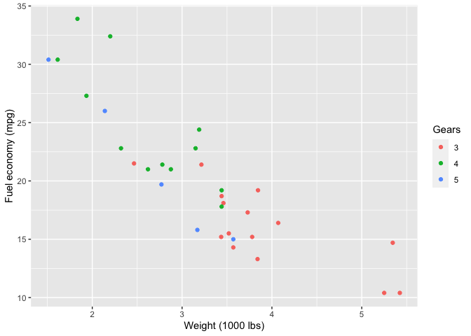
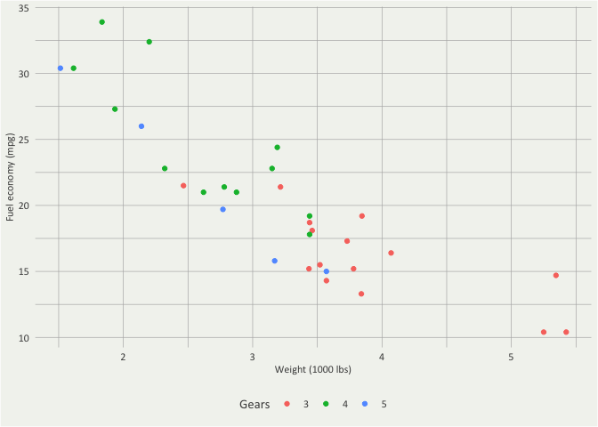
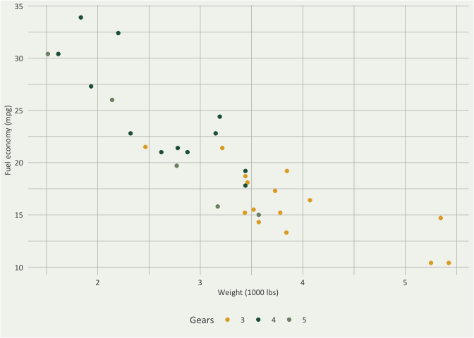

<!-- README.md is generated from README.Rmd. Please edit that file -->

# dezim

<!-- badges: start -->
<!-- badges: end -->

The dezim packages applies the DeZIM style guide formatting and DeZIM
colors to ggplot2 graphs.

## Installation

You can install the development version of dezim from
[GitHub](https://github.com/) with:

``` r
# install.packages("devtools")
devtools::install_github("liamhaller/dezim")
```

## Example

Add \`+ dezim_style() to ggplot2 graphs for DeZIM formatting

``` r
library(dezim)
library(ggplot2)

mtcars$gear <- as.factor(mtcars$gear)

p1 <- ggplot(mtcars) +
geom_point(aes(x = wt, y = mpg, colour = gear)) +
labs(
title = "Fuel economy declines as weight increases",
  x = "Weight (1000 lbs)",
  y = "Fuel economy (mpg)",
  colour = "Gears"
  )

# Default Graph
  p1
```



With DeZIM formatting

``` r
  p1 +
  dezim_style()
```



Finally, use dezim_colors for functions that require color/fill

``` r
 p1 +
 dezim_style() +
 scale_color_manual(values = dezim_colors)
```


